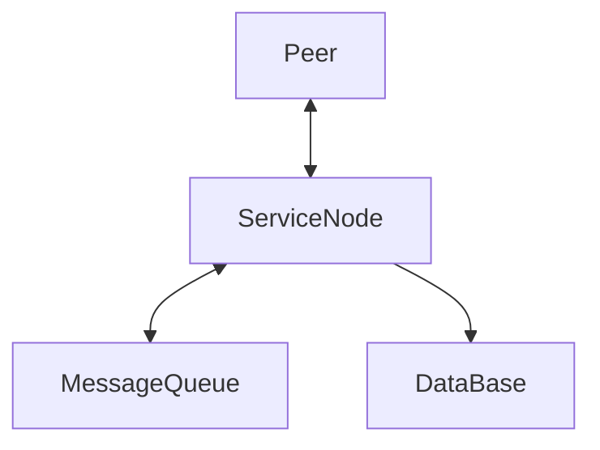
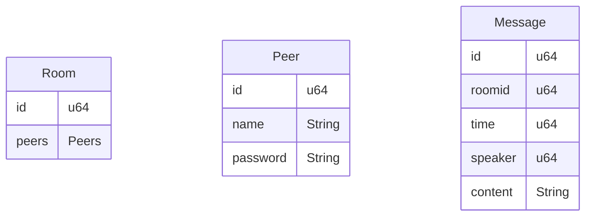
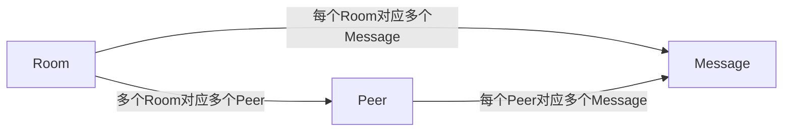

# 简易聊天室项目

## 架构示意图

<center>



</center>

## 数据结构

<center>




</center>

- Room
  - 聊天室的抽象
  - 承载一组Peer
  - Room与Peer呈现多对多关系
  - 这是需要永久保存的数据
  ```rust
  struct Room {
      id: u64,

      peers: Peers,
  }
  struct Rooms {
      inner: Vec<Room>,
  }
  ```

- Peer
  - 每个客户端的抽象
  - Room与Peer呈现多对多关系
  - 这是需要永久保存的数据
  ```rust
  struct Peer {
      id: u64,
      passsword: String,

      name: String,
      token: String,
  }
  struct Peers {
      inner: Vec<Peer>,
  }
  ```

- Chat
  - 聊天记录的抽象
  - 承载一个聊天室中的所有聊天记录
  - Chat与Room呈现一对一关系
  - 这是需要妥善保存的数据，一般每隔一段时间清理
  ```rust
  struct Chat {
      // 标识一个聊天室
      id: u64,
      // 该聊天室的最近消息记录
      messages: Messages,
  }
  struct Message {
      // Message的Id，用以快速查询Message
      id: u64,
      // 时间戳格式的Time
      time: u64,
      // 发送聊天记录的人，只记录Id
      speaker: u64,
      // 聊天记录的具体内容
      content: String,
  }
  struct Messages {
      inner: Vec<Message>
  }
  ```